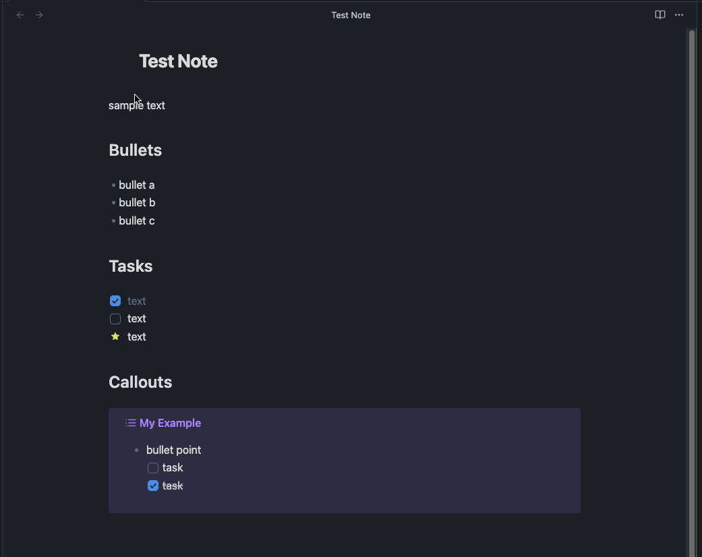

# Obsidian Task Status

Quickly change any task status in your Obsidian notes. The searchable modal enables a more dynamic and indiscriminate workflow when you need to change your checkbox markers.

## Instructions

Select one or more lines of text using cursors or a selection range. Then open the command palette and select the
`Task Status: change task status` command to display a semantically searchable quick menu to navigate
and apply one of several custom task status markers. Applying a task status marker will both swap
existing task markers and transform non-task content into tasks. The custom statues are configurable
and customizable through the plugin settings. If you'd like to set a hotkey, you might use `⌘ + Shift + L` on a
mac, or `CTRL + Shift + L` on Windows. I find this pairs well with the hotkey for "Toggle Checkbox Status".

Please note, that this plugin assumes that you have either installed an Obsidian theme which includes
custom task status styling (such as Things or Minimal), or that you've created and applied your own
CSS snippet to style tasks.

- [Setup AnuPpuccin Theme](./docs/Setup%20AnuPpuccin%20Theme.md)
- [Setup ITS Theme](./docs/Setup%20ITS%20Theme.md)
- [Setup Minimal Theme](./docs/Setup%20Minimal%20Theme.md)

## Why this plugin?

- keyboard driven
  - the design strives to keep your hands on the keyboard
  - your hands shouldn't need to jump between keys and mouse/trackball/trackpad
- semantically searchable quick menu
  - with the fuzzy finder, you won't have to remember which text character maps to which task status
  - facilitates quickly and indiscriminately jumping between any checkbox status
  - the presentation of the options enable you to perform a quick linear scan through the options list
- minimal configuration
  - pre-configured with checkbox style markers commonly used in Obsidian themes
  - the settings menu allows you to configure your own status markers.
  - *(your obsidian theme or custom CSS will need to provide the styling)*
- the goal is to complement other task related plugins

## Overview of Behavior

- works with various types of text selection:
  - single cursor placement
  - a selection range covering one or more lines
  - multiple cursors
  - multiple selection ranges
- general transformation behavior:
  - headings are ignored and will not be transformed
  - horizontal rules (thematic breaks) are ignored
  - indentation is preserved
  - block quotes are preserved
  - content within a quote block or nested quote block can be transformed
  - supports selecting text within an obsidian callout
  - blank lines...
    - a cursor selection on a blank line will transform it into a task
    - blank lines within a selection range are ignored

## Known Limitations

- **Headings**
  - Plugin currently supports ATX Headings (with `#` prefix)
  - Setext headings are parsed as separate lines of text
- **Code Blocks**
  - code blocks are not detected
  - any part of a code block that is selected will have the task markers appended to the front
  - For now, avoid including any part of a code block in your selection when applying task statuses
- **Obsidian Comments**
  - If a comment is part of your selection range, those lines will also have the checkbox marker appended to the front of the line (as if they were just text content and not a comment).
  - For now, avoid selecting comments

## Contributing

- please follow [conventional commit guidelines](https://www.conventionalcommits.org/)
